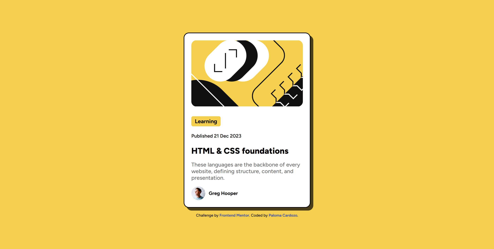

# Frontend Mentor - Blog preview card solution

This is my solution for the Frontend Mentor Blog preview card challenge (https://www.frontendmentor.io/challenges/blog-preview-card-ckPaj01IcS), using HTML and CSS.

## Table of contents

- [Overview](#overview)
  - [The challenge](#the-challenge)
  - [Screenshot](#screenshot)
  - [Links](#links)
- [My process](#my-process)
  - [Built with](#built-with)
  - [What I learned](#what-i-learned)
  - [Continued development](#continued-development)
  - [Useful resources](#useful-resources)
- [Author](#author)
- [Acknowledgments](#acknowledgments)

## Overview

### The challenge

Users should be able to:

- View the blog preview card with a neat and responsive layout.
- See hover effects and transitions for interactive elements.
- Ensure the design is mobile-friendly and adjusts smoothly to different screen sizes.

### Screenshot

Here is a preview of my solution: 

### Links

- Solution URL: (https://www.frontendmentor.io/solutions/blog-preview-card-with-flexbox-and-media-queries-OZraoS8483)
- Live Site URL: (https://paloma-cardozo.github.io/Blog-preview-card/)

## My process

### Built with

- Semantic HTML5 markup
- Flexbox

### What I learned

While working on this project, I gained valuable insights into:

- **Flexbox**: Improved my understanding of using Flexbox to center elements and manage layout structure efficiently.
- **Responsive design**: I focused on making the layout adaptable, although I plan to implement more responsive techniques in the future using media queries.
- **CSS transitions and hover effects**: I learned how to add subtle interactivity to my designs with smooth transitions on hover.
- **Semantic HTML**: This challenge reinforced the importance of using proper HTML elements to ensure accessibility.

Here’s a code example of my hover effect implementation:

  ```css
  .card:hover {
      box-shadow: 10px 10px 15px rgba(0, 0, 0, 0.5);
      transform: translateY(-5px);
      transition: all 0.3s ease-in-out;
  }
  ```

### Continued development

For future projects, I want to focus on:

1. Advanced CSS techniques: I plan to explore more advanced CSS concepts like CSS Grid to create more complex layouts.

2. JavaScript integration: I would love to add some interactivity to future projects, like a dynamic content loader or animations.

3. Improving accessibility: Continuing to focus on making sure my projects are accessible by testing them with different screen readers and devices.

### Useful resources

- [MDN Web Docs](https://developer.mozilla.org/en-US/) - A great reference for HTML, CSS, and JavaScript best practices. I specifically used it to refine my understanding of semantic HTML and to improve my Flexbox implementation.
- [Google Fonts](https://fonts.google.com/) - I used it to incorporate the 'Figtree' font, which enhanced both the readability and visual appeal of my design.
- [GitHub Docs](https://docs.github.com/en) - This helped me understand how to properly stage, commit, and push changes, as well as deploy my project on GitHub Pages.

## Author

- Frontend Mentor - [@Paloma-Cardozo](https://www.frontendmentor.io/profile/Paloma-Cardozo)
- GitHub URL - [Paloma-Cardozo](https://github.com/Paloma-Cardozo)

## Acknowledgments

I would like to express my heartfelt thanks to my husband and my daughter, who are always there to encourage and inspire me to keep pushing forward, reminding me why I love learning and creating. 

I would also like to thank my teachers at ReDI, whose enthusiasm and patience have made this journey into web development both challenging and exciting.

This project has been a mix of hard work, learning, and deep gratitude for the path I’m on. 
